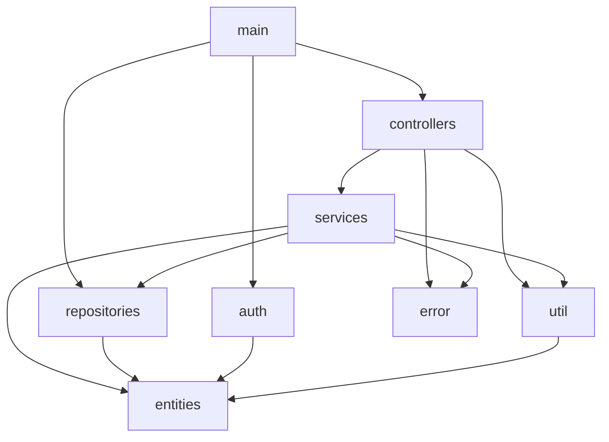
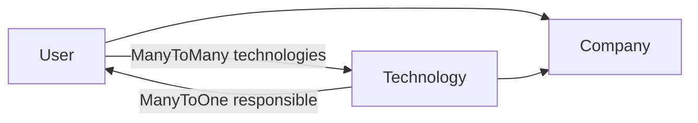
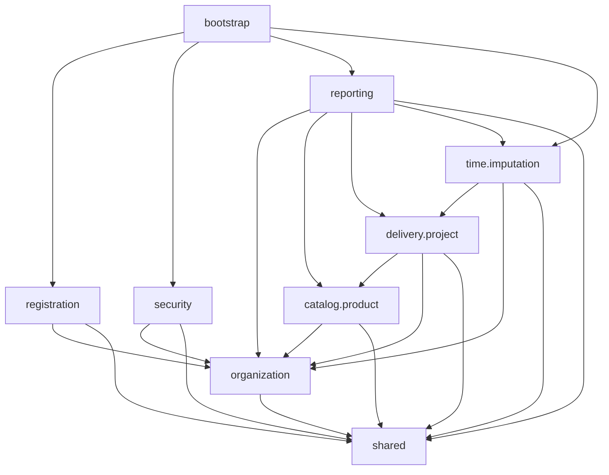
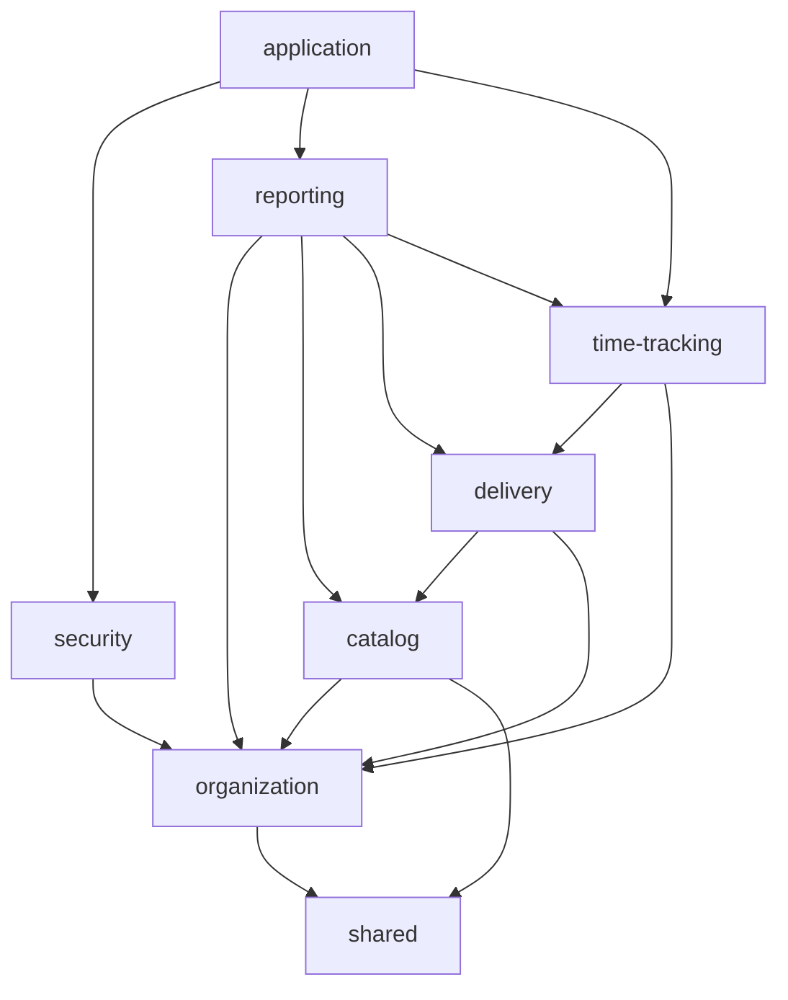

# Arquitectura objetivo del backend

Estado actualizado: 2026-09-05.

## Alcance de esta decisión

Esta fase define paquetes, responsabilidades y dependencias permitidas. No mueve clases ni cambia todavía los módulos Maven.

La reorganización inicial conserva los módulos actuales (`entities`, `repositories`, `services`, `controllers`, `auth`, `error`, `main`) y cambia progresivamente los paquetes Java para agrupar el código por capacidad funcional.

## Grafo Maven actual



`entities` y `error` son hojas. El módulo `util` ya no contiene código activo y deberá eliminarse del reactor Maven durante la reorganización por paquetes, después de verificar que no quedan referencias.

## Capacidades funcionales objetivo

| Capacidad | Responsabilidad | Código actual que posee |
|---|---|---|
| `organization.company` | Empresa cliente y límite de aislamiento | `Company`, `CompanyRepository`, `CompanyService` |
| `organization.user` | Usuarios, roles, perfil y administración | `User`, `Role`, contratos de usuario, repositorios y servicios de usuario |
| `organization.technology` | Tecnologías y responsable técnico | `Technology`, contratos, repositorio, servicio y controlador de tecnología |
| `catalog.product` | Productos, responsable, backup y tecnología | `Product`, contratos, repositorio, servicio y controlador de producto |
| `delivery.project` | Proyectos, fechas, producto, responsable y colaboradores | `Project`, contratos, repositorio, servicio y controlador de proyecto |
| `time.imputation` | Imputaciones diarias e ítems de tiempo | `Imputation`, `ImputationItem`, contratos, repositorio, servicio y controlador |
| `registration` | Alta coordinada de empresa y primer administrador | `AuthController`, `RegisterRequest` |
| `security` | Login JWT, validación, usuario/empresa actuales | filtros JWT, `SpringSecurityConfig`, `JwtService`, `CurrentUserContext`, `JpaUserDetailsService` |
| `reporting` | Consultas y read models con métricas entre dominios | proyecciones agregadas, consultas de métricas y ensamblado de resúmenes |
| `shared` | Contratos técnicos sin lógica de negocio | `PageResponse`, errores HTTP y factoría de errores |
| `bootstrap` | Arranque, perfiles, Flyway y ensamblado | `Main`, `application*.properties`, migraciones |

## Ciclo existente que condiciona el diseño

Existe un ciclo real en el modelo JPA:



Por este motivo, `user` y `technology` no deben convertirse ahora en módulos Maven separados. Ambos pertenecen inicialmente al contexto Maven candidato `organization`, junto con `company` y `role`. El ciclo queda contenido dentro de ese límite.

## Grafo funcional objetivo

Las flechas significan "puede depender de".



### Relaciones del modelo que justifican el grafo

- `User` pertenece a `Company` y conoce `Technology` mediante `users_technologies`.
- `Technology` pertenece a `Company` y referencia un `User` responsable.
- `Product` pertenece a `Company` y referencia `Technology`, responsable y backup.
- `Project` pertenece a `Company` y referencia `Product`, responsable y colaboradores.
- `Imputation` referencia `User`; cada `ImputationItem` referencia `Project`.
- Las consultas de métricas recorren varios dominios y por eso pertenecen a `reporting`, no al núcleo de `technology`, `product` o `project`.

## Estructura de paquetes objetivo dentro de los módulos actuales

Cada módulo Maven conservará su responsabilidad técnica durante la primera migración, pero los paquetes expresarán el dominio.

```text
com.arinno.canopus
├── organization
│   ├── company
│   │   ├── api
│   │   ├── application
│   │   ├── domain
│   │   ├── contract
│   │   └── infrastructure.persistence
│   ├── user
│   │   ├── api
│   │   ├── application
│   │   ├── domain
│   │   ├── contract
│   │   └── infrastructure.persistence
│   └── technology
│       ├── api
│       ├── application
│       ├── domain
│       ├── contract
│       └── infrastructure.persistence
├── catalog.product
│   ├── api
│   ├── application
│   ├── domain
│   ├── contract
│   └── infrastructure.persistence
├── delivery.project
│   ├── api
│   ├── application
│   ├── domain
│   ├── contract
│   └── infrastructure.persistence
├── time.imputation
│   ├── api
│   ├── application
│   ├── domain
│   ├── contract
│   └── infrastructure.persistence
├── reporting
│   ├── application
│   ├── contract
│   └── infrastructure.persistence
├── registration.api
├── security
├── shared
│   ├── contract
│   └── error
└── bootstrap
```

### Distribución física mientras se conservan los módulos Maven

| Módulo actual | Sufijos de paquete que contiene |
|---|---|
| `entities` | `*.domain`, `*.contract`, `shared.contract` |
| `repositories` | `*.infrastructure.persistence` |
| `services` | `*.application`, servicios de `security` |
| `controllers` | `*.api`, mapeadores de contrato y `registration.api` |
| `auth` | filtros y configuración de `security` |
| `error` | `shared.error` |
| `main` | `bootstrap` |

Una misma capacidad queda distribuida físicamente entre módulos durante esta fase, pero comparte una raíz de paquete reconocible. Ejemplo:

```text
entities/.../catalog/product/domain/Product.java
entities/.../catalog/product/contract/ProductRequest.java
repositories/.../catalog/product/infrastructure/persistence/ProductRepository.java
services/.../catalog/product/application/ProductService.java
controllers/.../catalog/product/api/ProductController.java
```

## Reglas de dependencia

1. `api` llama a `application`; no accede directamente a repositorios.
2. `application` coordina casos de uso y usa repositorios o servicios de capacidades inferiores.
3. `domain` no importa controladores, mapeadores, DTOs HTTP ni configuración Spring Security.
4. `infrastructure.persistence` implementa acceso a datos y puede importar el modelo `domain` que persiste.
5. Los comandos HTTP reciben DTOs de `contract`; nunca entidades JPA directamente.
6. Toda relación recibida por ID se resuelve dentro de la compañía autenticada antes de persistirse.
7. `shared` no contiene entidades ni reglas específicas de un dominio.
8. `security` puede resolver identidad y compañía, pero no consultar productos, proyectos ni imputaciones.
9. Las métricas que combinan dominios se implementan como consultas/read models en `reporting`; los mapeadores no deben ejecutar varias consultas por elemento.
10. Ninguna capacidad inferior depende de una superior: `organization` no importa `catalog`, `delivery` ni `time`.
11. No se crea un nuevo módulo Maven si introduce una dependencia circular.
12. Cada movimiento de paquete debe mantener compilación, tests, integración HTTP y construcción del JAR en verde.

## Dependencias transitorias que deben corregirse

| Dependencia actual | Problema | Destino objetivo |
|---|---|---|
| `TechnologyMapper` consulta servicios de producto, proyecto e imputación | La presentación de tecnología depende de capacidades superiores y genera N+1 | `reporting` devuelve `TechnologySummary` agregado |
| `ProductMapper` consulta proyecto e imputación | El mapeador ejecuta consultas y mezcla conversión con lectura | `reporting` devuelve `ProductSummary`/`ProductDetail` |
| `ProjectMapper` consulta imputación | El mapeador no es puro | read model en `reporting` o consulta agregada de proyecto |
| `ImputationRepository` contiene agregados por producto/proyecto/tecnología | El repositorio de escritura conoce varias capacidades | mover consultas transversales a `reporting.infrastructure.persistence` |
| DTOs y entidades comparten el módulo `entities` | El contrato HTTP queda acoplado al modelo persistente | separar por paquetes `domain` y `contract` ahora; evaluar módulos después |

## Candidatos futuros de módulos Maven

Esta lista es evidencia para la decisión del paso 5; no constituye todavía una decisión de extracción.



### Restricciones para una futura extracción

- `company`, `user`, `role` y `technology` se extraen juntos como `organization` mientras exista el ciclo JPA.
- `reporting` se extrae sólo después de retirar consultas cruzadas de los mapeadores y repositorios de escritura.
- `application`/`bootstrap` es el único módulo que ensambla todos los adaptadores.
- `shared` debe permanecer pequeño y técnico; no puede convertirse en un contenedor genérico de código sin dueño.
- Si una capacidad no tiene una API estable o no puede aislarse sin ciclos, permanece como paquete y no como módulo Maven.

## Secuencia para la reorganización por paquetes

1. Crear raíces `shared` y `organization.company` y mover contratos técnicos/empresa.
2. Mover conjuntamente `organization.user` y `organization.technology` para controlar su ciclo.
3. Mover `catalog.product`.
4. Mover `delivery.project`.
5. Mover `time.imputation`.
6. Separar consultas transversales bajo `reporting`.
7. Mover autenticación a `security` y registro a `registration`.
8. Mover `Main` y configuración conceptual a `bootstrap`.
9. Eliminar el módulo Maven `util` vacío y sus dependencias.
10. Validar tests, build frontend, empaquetado y arranque local después de cada bloque.

## Criterios de aceptación

- Cada clase activa tiene una capacidad propietaria clara.
- El grafo objetivo no contiene ciclos entre capacidades de nivel superior; el ciclo `user`/`technology` queda encapsulado en `organization`.
- Las reglas de dependencia están documentadas y pueden verificarse mediante imports.
- Se documentan las dependencias transitorias que impiden extraer módulos Maven hoy.
- Los candidatos futuros de módulos forman un grafo acíclico.
- La fase siguiente puede mover paquetes de forma incremental sin decidir todavía una división definitiva de módulos Maven.
